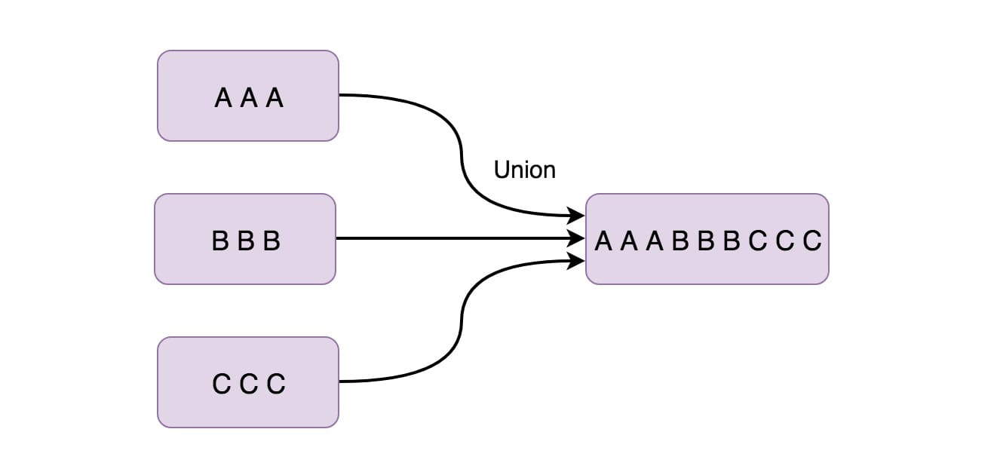
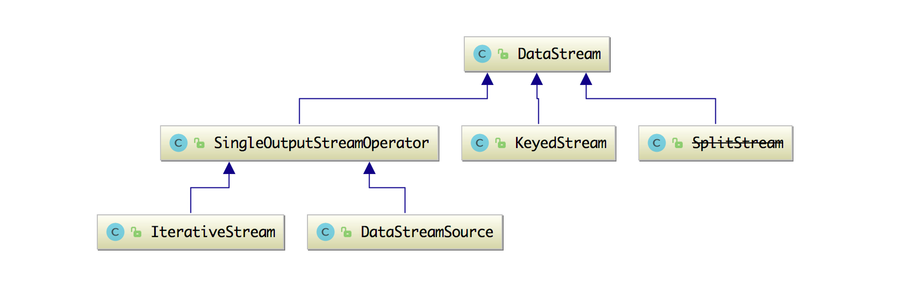
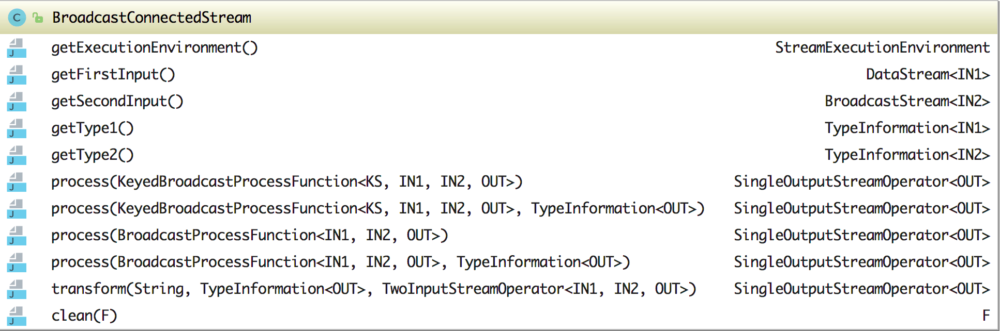

# flink 学习记录

> tips: 大部分内容源自zhisheng的博客, 在此仅用于学习记录

参考链接：

* [getting-started_1.9](https://ci.apache.org/projects/flink/flink-docs-release-1.9/getting-started/tutorials/local_setup.html)
* [flink-learning](https://github.com/zhisheng17/flink-learning)

## 时间语义

* Processing Time：事件被处理时机器的系统时间
* Event Time：事件自身的时间
* Ingestion Time：事件进入 Flink 的时间

### Processing Time

Processing Time 是指事件被处理时机器的系统时间。

> 如果我们 Flink Job 设置的时间策略是 Processing Time 的话，那么后面所有基于时间的操作（如时间窗口）都将会使用当时机器的系统时间。每小时 Processing Time 窗口将包括在系统时钟指示整个小时之间到达特定操作的所有事件。
>
> 例如，如果应用程序在上午 9:15 开始运行，则第一个每小时 Processing Time 窗口将包括在上午 9:15 到上午 10:00 之间处理的事件，下一个窗口将包括在上午 10:00 到 11:00 之间处理的事件。
>
> Processing Time 是最简单的 "Time" 概念，不需要流和机器之间的协调，它提供了最好的性能和最低的延迟。但是，在分布式和异步的环境下，Processing Time 不能提供确定性，因为它容易受到事件到达系统的速度（例如从消息队列）、事件在系统内操作流动的速度以及中断的影响。

### Event Time

> Event Time 是指事件发生的时间，一般就是数据本身携带的时间。这个时间通常是在事件到达 Flink 之前就确定的，并且可以从每个事件中获取到事件时间戳。在 Event Time 中，时间取决于数据，而跟其他没什么关系。Event Time 程序必须指定如何生成 Event Time 水印，这是表示 Event Time 进度的机制。
>
> 完美的说，无论事件什么时候到达或者其怎么排序，最后处理 Event Time 将产生完全一致和确定的结果。但是，除非事件按照已知顺序（事件产生的时间顺序）到达，否则处理 Event Time 时将会因为要等待一些无序事件而产生一些延迟。由于只能等待一段有限的时间，因此就难以保证处理 Event Time 将产生完全一致和确定的结果。
>
> 假设所有数据都已到达，Event Time 操作将按照预期运行，即使在处理无序事件、延迟事件、重新处理历史数据时也会产生正确且一致的结果。 例如，每小时事件时间窗口将包含带有落入该小时的事件时间戳的所有记录，不管它们到达的顺序如何（是否按照事件产生的时间）。
  
### Ingestion Time

> Ingestion Time 是事件进入 Flink 的时间。 在数据源操作处（进入 Flink source 时），每个事件将进入 Flink 时当时的时间作为时间戳，并且基于时间的操作（如时间窗口）会利用这个时间戳。
>
> Ingestion Time 在概念上位于 Event Time 和 Processing Time 之间。 与 Processing Time 相比，成本可能会高一点，但结果更可预测。因为 Ingestion Time 使用稳定的时间戳（只在进入 Flink 的时候分配一次），所以对事件的不同窗口操作将使用相同的时间戳（第一次分配的时间戳），而在 Processing Time 中，每个窗口操作符可以将事件分配给不同的窗口（基于机器系统时间和到达延迟）。
>  
> 与 Event Time 相比，Ingestion Time 程序无法处理任何无序事件或延迟数据，但程序中不必指定如何生成水印。

`综述： 在 Flink 中，Ingestion Time 与 Event Time 非常相似，唯一区别就是 Ingestion Time 具有自动分配时间戳和自动生成水印功能。`

### 如何设置 Time 策略

在创建完流运行环境的时候，然后就可以通过 env.setStreamTimeCharacteristic 设置时间策略：

```java
final StreamExecutionEnvironment env = StreamExecutionEnvironment.getExecutionEnvironment();
env.setStreamTimeCharacteristic(TimeCharacteristic.EventTime);

// 其他两种:
// env.setStreamTimeCharacteristic(TimeCharacteristic.IngestionTime);
// env.setStreamTimeCharacteristic(TimeCharacteristic.ProcessingTime);
```

### 使用场景分析

> 一般来说在生产环境中将 Event Time 与 Processing Time 对比的比较多，这两个也是我们常用的策略，Ingestion Time 一般用的较少。
>
> 用 Processing Time 的场景大多是用户不关心事件时间，它只需要关心这个时间窗口要有数据进来，只要有数据进来了，我就可以对进来窗口中的数据进行一系列的计算操作，然后再将计算后的数据发往下游。
>
> 而用 Event Time 的场景一般是业务需求需要时间这个字段（比如购物时是要先有下单事件、再有支付事件；借贷事件的风控是需要依赖时间来做判断的；机器异常检测触发的告警也是要具体的异常事件的时间展示出来；商品广告及时精准推荐给用户依赖的就是用户在浏览商品的时间段/频率/时长等信息），只能根据事件时间来处理数据，而且还要从事件中获取到事件的时间。
>
> 问题： 数据出现一定的乱序、延迟几分钟等
>
> 解决： Flink WaterMark机制

## 窗口（Window）

> 举个栗子：
>
> 通传感器的示例：统计经过某红绿灯的汽车数量之和？
> 假设在一个红绿灯处，我们每隔 15 秒统计一次通过此红绿灯的汽车数量
>
> 可以把汽车的经过看成一个流，无穷的流，不断有汽车经过此红绿灯，因此无法统计总共的汽车数量。但是，我们可以换一种思路，每隔 15 秒，我们都将与上一次的结果进行 sum 操作（滑动聚合）
>
> 定义一个 Window（窗口），Window 的界限是 1 分钟，且每分钟内的数据互不干扰，因此也可以称为翻滚（不重合）窗口
> 这样就可以统计出每分钟的数量。。。60个window
>
> 再考虑一种情况，每 30 秒统计一次过去 1 分钟的汽车数量之和
> 数据重合，120个window

### Window 有什么作用

> 通常来讲，Window 就是用来对一个无限的流设置一个有限的集合，在有界的数据集上进行操作的一种机制。Window 又可以分为基于时间（Time-based）的 Window 以及基于数量（Count-based）的 window。

### Flink 自带的 Window

Flink 在 KeyedStream（DataStream 的继承类） 中提供了下面几种 Window：

* 以时间驱动的 Time Window
* 以事件数量驱动的 Count Window
* 以会话间隔驱动的 Session Window

`由于某些特殊的需要，DataStream API 也提供了定制化的 Window 操作，供用户自定义 Window。`

#### Time Window 使用及源码分析

> Time Window 根据时间来聚合流数据。例如：一分钟的时间窗口就只会收集一分钟的元素，并在一分钟过后对窗口中的所有元素应用于下一个算子。

示例Code:

> 输入一个时间参数，这个时间参数可以利用 Time 这个类来控制，如果事前没指定 TimeCharacteristic 类型的话，则默认使用的是 ProcessingTime

```java
dataStream.keyBy(1)
    .timeWindow(Time.minutes(1)) //time Window 每分钟统计一次数量和
    .sum(1);
```

时间窗口的数据窗口聚合流程如下图所示


在第一个窗口中（1 ～ 2 分钟）和为7、第二个窗口中（2 ～ 3 分钟）和为 12、第三个窗口中（3 ～ 4 分钟）和为 7、第四个窗口中（4 ～ 5 分钟）和为 19。

该 timeWindow 方法在 KeyedStream 中对应的源码如下：

```java
//时间窗口
public WindowedStream<T, KEY, TimeWindow> timeWindow(Time size) {
    if (environment.getStreamTimeCharacteristic() == TimeCharacteristic.ProcessingTime) {
        return window(TumblingProcessingTimeWindows.of(size));
    } else {
        return window(TumblingEventTimeWindows.of(size));
    }
}
```

另外在 Time Window 中还支持滑动的时间窗口，比如定义了一个每 30s 滑动一次的 1 分钟时间窗口，它会每隔 30s 去统计过去一分钟窗口内的数据，同样使用也很简单，输入两个时间参数，如下：

```java
dataStream.keyBy(1)
    .timeWindow(Time.minutes(1), Time.seconds(30)) //sliding time Window 每隔 30s 统计过去一分钟的数量和
    .sum(1);
```

滑动时间窗口的数据聚合流程如下图所示：


在该第一个时间窗口中（1 ～ 2 分钟）和为 7，第二个时间窗口中（1:30 ~ 2:30）和为 10，第三个时间窗口中（2 ~ 3 分钟）和为 12，第四个时间窗口中（2:30 ~ 3:30）和为 10，第五个时间窗口中（3 ~ 4 分钟）和为 7，第六个时间窗口中（3:30 ~ 4:30）和为 11，第七个时间窗口中（4 ~ 5 分钟）和为 19。

```java
//滑动时间窗口
public WindowedStream<T, KEY, TimeWindow> timeWindow(Time size, Time slide) {
    if (environment.getStreamTimeCharacteristic() == TimeCharacteristic.ProcessingTime) {
        return window(SlidingProcessingTimeWindows.of(size, slide));
    } else {
        return window(SlidingEventTimeWindows.of(size, slide));
    }
}
```

#### Count Window 使用及源码分析

> Apache Flink 还提供计数窗口功能，如果计数窗口的值设置的为 3 ，那么将会在窗口中收集 3 个事件，并在添加第 3 个元素时才会计算窗口中所有事件的值。

示例Code:

```java
dataStream.keyBy(1)
    .countWindow(3) //统计每 3 个元素的数量之和
    .sum(1);
```

计数窗口的数据窗口聚合流程如下图所示：


该 countWindow 方法在 KeyedStream 中对应的源码如下：

```java
//计数窗口
public WindowedStream<T, KEY, GlobalWindow> countWindow(long size) {
    return window(GlobalWindows.create()).trigger(PurgingTrigger.of(CountTrigger.of(size)));
}
```

另外在 Count Window 中还支持滑动的计数窗口，比如定义了一个每 3 个事件滑动一次的 4 个事件的计数窗口，它会每隔 3 个事件去统计过去 4 个事件计数窗口内的数据，使用也很简单，输入两个 long 类型的参数，如下：

```java
dataStream.keyBy(1)
    .countWindow(4, 3) //每隔 3 个元素统计过去 4 个元素的数量之和
    .sum(1);
```

滑动计数窗口的数据窗口聚合流程如下图所示：


该 countWindow 方法在 KeyedStream 中对应的源码如下：

```java
//滑动计数窗口
public WindowedStream<T, KEY, GlobalWindow> countWindow(long size, long slide) {
    return window(GlobalWindows.create()).evictor(CountEvictor.of(size)).trigger(CountTrigger.of(slide));
}
```

#### Session Window 使用及源码分析

> Apache Flink 还提供了会话窗口，是什么意思呢？使用该窗口的时候你可以传入一个时间参数（表示某种数据维持的会话持续时长），如果超过这个时间，就代表着超出会话时长。

```java
dataStream.keyBy(1)
    .window(ProcessingTimeSessionWindows.withGap(Time.seconds(5)))//表示如果 5s 内没出现数据则认为超出会话时长，然后计算这个窗口的和
    .sum(1);
```

会话窗口的数据窗口聚合流程如下图所示:


该 Window 方法在 KeyedStream 中对应的源码如下：

```java
//提供自定义 Window
public <W extends Window> WindowedStream<T, KEY, W> window(WindowAssigner<? super T, W> assigner) {
    return new WindowedStream<>(this, assigner);
}
```

### 如何自定义 Window


#### Window 源码定义

```java
public abstract class Window {
    //获取属于此窗口的最大时间戳
    public abstract long maxTimestamp();
}
```

> Window 类图


> TimeWindow 源码定义如下:

```java
public class TimeWindow extends Window {
    //窗口开始时间
    private final long start;
    //窗口结束时间
    private final long end;
}
```

> GlobalWindow 源码定义如下：

```java
public class GlobalWindow extends Window {

    private static final GlobalWindow INSTANCE = new GlobalWindow();

    private GlobalWindow() { }
    //对外提供 get() 方法返回 GlobalWindow 实例，并且是个全局单例
    public static GlobalWindow get() {
        return INSTANCE;
    }
}
```

### Window 组件之 WindowAssigner 使用及源码分析

> 到达窗口操作符的元素被传递给 WindowAssigner。WindowAssigner 将元素分配给一个或多个窗口，可能会创建新的窗口。
>
> 窗口本身只是元素列表的标识符，它可能提供一些可选的元信息，例如 TimeWindow 中的开始和结束时间。注意，元素可以被添加到多个窗口，这也意味着一个元素可以同时在多个窗口存在。
>
> WindowAssigner 的代码定义：

```java
public abstract class WindowAssigner<T, W extends Window> implements Serializable {
    //分配数据到窗口并返回窗口集合
    public abstract Collection<W> assignWindows(T element, long timestamp, WindowAssignerContext context);
}
```

> WindowAssigner抽象类有如下实现类：


> WindowAssigner 实现类的作用介绍

| Assigner | 说明 |
| - | - |
| GlobalWindows | 所有数据都分配到同一个窗口(GlobalWindow) |
| TumblingProcessingTimeWindows | 基于处理时间的滚动窗口分配处理 |
| TumblingEventTimeWindows | 基于事件时间的滚动窗口分配处理 |
| SlidingEventTimeWindows | 基于事件时间的滑动窗口分配处理 |
| SlidingProcessingTimeWindows | 基于处理时间的滑动窗口分配处理 |
| MergingWindowAssigner | 一个抽象类，提供merge 窗口的方法 |
| EventTimeSessionWindows | 基于事件时间可Merge的会话窗口分配处理 |
| ProcessingTimeSessionWindows | 基于处理时间可Merge的会话窗口分配处理 |

> 实现规律：

* 1、定义好实现类的属性
* 2、根据定义的属性添加构造方法
* 3、重写 WindowAssigner 中的 assignWindows 等方法
* 4、定义其他的方法供外部调用

> TumblingEventTimeWindows 源码：

```java
public class TumblingEventTimeWindows extends WindowAssigner<Object, TimeWindow> {
    //定义属性
    private final long size;
    private final long offset;

    //构造方法
    protected TumblingEventTimeWindows(long size, long offset) {
        if (Math.abs(offset) >= size) {
            throw new IllegalArgumentException("TumblingEventTimeWindows parameters must satisfy abs(offset) < size");
        }
        this.size = size;
        this.offset = offset;
    }

    //重写 WindowAssigner 抽象类中的抽象方法 assignWindows
    @Override
    public Collection<TimeWindow> assignWindows(Object element, long timestamp, WindowAssignerContext context) {
        //实现该 TumblingEventTimeWindows 中的具体逻辑
    }

    //其他方法，对外提供静态方法，供其他类调用
}
```

### Window 组件之 Trigger 使用及源码分析

> Trigger 表示触发器，每个窗口都拥有一个 Trigger（触发器），该 Trigger 决定何时计算和清除窗口。当先前注册的计时器超时时，将为插入窗口的每个元素调用触发器。在每个事件上，触发器都可以决定触发，即清除（删除窗口并丢弃其内容），或者启动并清除窗口。一个窗口可以被求值多次，并且在被清除之前一直存在。注意，在清除窗口之前，窗口将一直消耗内存。
>
> Trigger 源码

```java
public abstract class Trigger<T, W extends Window> implements Serializable {
    //当有数据进入到 Window 运算符就会触发该方法
    public abstract TriggerResult onElement(T element, long timestamp, W window, TriggerContext ctx) throws Exception;
    //当使用触发器上下文设置的处理时间计时器触发时调用
    public abstract TriggerResult onProcessingTime(long time, W window, TriggerContext ctx) throws Exception;
    //当使用触发器上下文设置的事件时间计时器触发时调用该方法
    public abstract TriggerResult onEventTime(long time, W window, TriggerContext ctx) throws Exception;
}
```

> TriggerResult 源码

```java
public enum TriggerResult {

    //不做任何操作
    CONTINUE(false, false),

    //处理并移除窗口中的数据
    FIRE_AND_PURGE(true, true),

    //处理窗口数据，窗口计算后不做清理
    FIRE(true, false),

    //清除窗口中的所有元素，并且在不计算窗口函数或不发出任何元素的情况下丢弃窗口
    PURGE(false, true);
}
```

> Trigger 抽象类的实现类


> Trigger 实现类的作用介绍

| Trigger | 说明 | 
| - | - |
| EventTimeTrigger | 当水印通过窗口末尾时触发的触发器 |
| ProcessingTimeTrigger | 当系统时间通过窗口末尾时触发的触发器 |
| DeltaTrigger | 一种基于DeltaFunction和阈值触发的触发器 |
| CountTrigger | 一旦窗口中的元素数量达到给定数量时就触发的触发器 |
| PurgingTrigger | 一种触发器，可以将任何触发器转换为清除触发器 |
| ContinuousProcessingTimeTrigger | 触发器根据给定的时间间隔连续触发，时间间隔依赖于Job所在机器的系统时间 |
| ContinuousEventTimeTrigger | 触发器根据给定的时间间隔连续触发，时间间隔依赖于水印时间戳 |
| NeverTrigger | 一个从来不触发的触发器，作为GlobalWindow的默认触发器 |

> 实现规律：

* 1、定义好实现类的属性

* 2、根据定义的属性添加构造方法

* 3、重写 Trigger 中的 onElement、onEventTime、onProcessingTime 等方法

* 4、定义其他的方法供外部调用

> CountTrigger 源码

```java
public class CountTrigger<W extends Window> extends Trigger<Object, W> {
    //定义属性
    private final long maxCount;

    private final ReducingStateDescriptor<Long> stateDesc = new ReducingStateDescriptor<>("count", new Sum(), LongSerializer.INSTANCE);
    //构造方法
    private CountTrigger(long maxCount) {
        this.maxCount = maxCount;
    }

    //重写抽象类 Trigger 中的抽象方法 
    @Override
    public TriggerResult onElement(Object element, long timestamp, W window, TriggerContext ctx) throws Exception {
        //实现 CountTrigger 中的具体逻辑
    }

    @Override
    public TriggerResult onEventTime(long time, W window, TriggerContext ctx) {
        return TriggerResult.CONTINUE;
    }

    @Override
    public TriggerResult onProcessingTime(long time, W window, TriggerContext ctx) throws Exception {
        return TriggerResult.CONTINUE;
    }
}
``` 

### Window 组件之 Evictor 使用及源码分析

> Evictor 表示驱逐者，它可以遍历窗口元素列表，并可以决定从列表的开头删除首先进入窗口的一些元素，然后其余的元素被赋给一个计算函数，如果没有定义 Evictor，触发器直接将所有窗口元素交给计算函数。
>
> Evictor 的源码

```java
public interface Evictor<T, W extends Window> extends Serializable {
    //在窗口函数之前调用该方法选择性地清除元素
    void evictBefore(Iterable<TimestampedValue<T>> elements, int size, W window, EvictorContext evictorContext);
    //在窗口函数之后调用该方法选择性地清除元素
    void evictAfter(Iterable<TimestampedValue<T>> elements, int size, W window, EvictorContext evictorContext);
}
```

> Evictor的实现类


> Evictor 实现类的作用介绍

| Evictor | 说明 |
| - | - |
| TimeEvictor | 元素可以在窗口中存在一段时间，老数据会被清除 |
| CountEvictor | 窗口中可以保存指定数量的数据，超过则会清除老的数据 |
| DeltaEvictor | 根据DeltaFunction 的实现和阈值来决定如何清理数据 |

> 实现规律：

* 1、定义好实现类的属性

* 2、根据定义的属性添加构造方法

* 3、重写 Evictor 中的 evictBefore 和 evictAfter 方法

* 4、定义关键的内部实现方法 evict，处理具体的逻辑

* 5、定义其他的方法供外部调用

> CountEvictor 的源码

```java
public class CountEvictor<W extends Window> implements Evictor<Object, W> {
    private static final long serialVersionUID = 1L;

    //定义属性
    private final long maxCount;
    private final boolean doEvictAfter;

    //构造方法
    private CountEvictor(long count, boolean doEvictAfter) {
        this.maxCount = count;
        this.doEvictAfter = doEvictAfter;
    }
    //构造方法
    private CountEvictor(long count) {
        this.maxCount = count;
        this.doEvictAfter = false;
    }

    //重写 Evictor 中的 evictBefore 方法
    @Override
    public void evictBefore(Iterable<TimestampedValue<Object>> elements, int size, W window, EvictorContext ctx) {
        if (!doEvictAfter) {
            //调用内部的关键实现方法 evict
            evict(elements, size, ctx);
        }
    }

    //重写 Evictor 中的 evictAfter 方法
    @Override
    public void evictAfter(Iterable<TimestampedValue<Object>> elements, int size, W window, EvictorContext ctx) {
        if (doEvictAfter) {
            //调用内部的关键实现方法 evict
            evict(elements, size, ctx);
        }
    }

    private void evict(Iterable<TimestampedValue<Object>> elements, int size, EvictorContext ctx) {
        //内部的关键实现方法
    }

    //其他的方法
}
```

> Flink 自带的 Window（Time Window、Count Window、Session Window）, 最后都会调用 Window 方法，源码如下： 

```java
//提供自定义 Window
public <W extends Window> WindowedStream<T, KEY, W> window(WindowAssigner<? super T, W> assigner) {
    return new WindowedStream<>(this, assigner);
}

//构造一个 WindowedStream 实例
public WindowedStream(KeyedStream<T, K> input,
        WindowAssigner<? super T, W> windowAssigner) {
    this.input = input;
    this.windowAssigner = windowAssigner;
    //获取一个默认的 Trigger
    this.trigger = windowAssigner.getDefaultTrigger(input.getExecutionEnvironment());
}
```

> Window 方法传入的参数是一个 WindowAssigner 对象, （可以利用Flink 现有的 WindowAssigner, 也可以自定义自己的WindowAssigner）, 然后再通过构造一个 WindowedStream 实例（在构造实例的会传入 WindowAssigner 和获取默认的 Trigger）来创建一个 Window。
>
> 滑动计数窗口，在调用 window 方法之后，还调用了 WindowedStream 的 evictor 和 trigger 方法，trigger 方法会覆盖掉你之前调用 Window 方法中默认的 trigger，如下：

```java
//滑动计数窗口
public WindowedStream<T, KEY, GlobalWindow> countWindow(long size, long slide) {
    return window(GlobalWindows.create()).evictor(CountEvictor.of(size)).trigger(CountTrigger.of(slide));
}

//trigger 方法
public WindowedStream<T, K, W> trigger(Trigger<? super T, ? super W> trigger) {
    if (windowAssigner instanceof MergingWindowAssigner && !trigger.canMerge()) {
        throw new UnsupportedOperationException("A merging window assigner cannot be used with a trigger that does not support merging.");
    }

    if (windowAssigner instanceof BaseAlignedWindowAssigner) {
        throw new UnsupportedOperationException("Cannot use a " + windowAssigner.getClass().getSimpleName() + " with a custom trigger.");
    }
    //覆盖之前的 trigger
    this.trigger = trigger;
    return this;
}
```

> Evictor 是可选的，但是 WindowAssigner 和 Trigger 是必须会有的，这种创建 Window 的方法充分利用了 KeyedStream 和 WindowedStream 的 API，再加上现有的 WindowAssigner、Trigger、Evictor, 就可以创建Window

## 算子（Operator）

> Source --> Transformation --> Sink

在 Flink 应用程序中，无论你的应用程序是批程序，还是流程序，都是上图这种模型，有数据源（source），有数据下游（sink），我们写的应用程序多是对数据源过来的数据做一系列操作，总结如下。

* 1、`Source`: 数据源，Flink 在流处理和批处理上的 source 大概有 4 类：基于本地集合的 source、基于文件的 source、基于网络套接字的 source、自定义的 source。自定义的 source 常见的有 Apache kafka、Amazon Kinesis Streams、RabbitMQ、Twitter Streaming API、Apache NiFi 等，当然你也可以定义自己的 source。

* 2、`Transformation`: 数据转换的各种操作，有 Map / FlatMap / Filter / KeyBy / Reduce / Fold / Aggregations / Window / WindowAll / Union / Window join / Split / Select / Project 等，操作很多，可以将数据转换计算成你想要的数据。

* 3、`Sink`: 接收器，Sink 是指 Flink 将转换计算后的数据发送的地点 ，你可能需要存储下来。Flink 常见的 Sink 大概有如下几类：写入文件、打印出来、写入 Socket 、自定义的 Sink 。自定义的 sink 常见的有 Apache kafka、RabbitMQ、MySQL、ElasticSearch、Apache Cassandra、Hadoop FileSystem 等，同理你也可以定义自己的 Sink。

### DataStream Operator

#### Map

Map 算子的输入流是 DataStream，经过 Map 算子后返回的数据格式是 SingleOutputStreamOperator 类型，获取一个元素并生成一个元素，举个例子：

```java
SingleOutputStreamOperator<Employee> map = employeeStream.map(new MapFunction<Employee, Employee>() {
    @Override
    public Employee map(Employee employee) throws Exception {
        employee.salary = employee.salary + 5000;
        return employee;
    }
});
map.print();
```

#### FlatMap

FlatMap 算子的输入流是 DataStream，经过 FlatMap 算子后返回的数据格式是 SingleOutputStreamOperator 类型，获取一个元素并生成零个、一个或多个元素，举个例子：

```java
SingleOutputStreamOperator<Employee> flatMap = employeeStream.flatMap(new FlatMapFunction<Employee, Employee>() {
    @Override
    public void flatMap(Employee employee, Collector<Employee> out) throws Exception {
        if (employee.salary >= 40000) {
            out.collect(employee);
        }
    }
});
flatMap.print();
```

#### Filter

对每个元素都进行判断，返回为 true 的元素，如果为 false 则丢弃数据

```java

SingleOutputStreamOperator<Employee> filter = employeeStream.filter(new FilterFunction<Employee>() {
    @Override
    public boolean filter(Employee employee) throws Exception {
        if (employee.salary >= 40000) {
            return true;
        }
        return false;
    }
});
filter.print();
```

#### KeyBy


KeyBy 在逻辑上是基于 key 对流进行分区，相同的 Key 会被分到一个分区（这里分区指的就是下游算子多个并行节点的其中一个）。在内部，它使用 hash 函数对流进行分区。它返回 KeyedDataStream 数据流。举个例子：

```java
KeyedStream<ProductEvent, Integer> keyBy = productStream.keyBy(new KeySelector<ProductEvent, Integer>() {
    @Override
    public Integer getKey(ProductEvent product) throws Exception {
        return product.shopId;
    }
});
keyBy.print();
```

#### Reduce

Reduce 返回单个的结果值，并且 reduce 操作每处理一个元素总是创建一个新值。常用的方法有 `average`、`sum`、`min`、`max`、`count`，使用 Reduce 方法都可实现。

```java
SingleOutputStreamOperator<Employee> reduce = employeeStream.keyBy(new KeySelector<Employee, Integer>() {
    @Override
    public Integer getKey(Employee employee) throws Exception {
        return employee.shopId;
    }
}).reduce(new ReduceFunction<Employee>() {
    @Override
    public Employee reduce(Employee employee1, Employee employee2) throws Exception {
        employee1.salary = (employee1.salary + employee2.salary) / 2;
        return employee1;
    }
});
reduce.print();
```

上面先将数据流进行 keyby 操作，因为执行 Reduce 操作只能是 KeyedStream，然后将员工的工资做了一个求平均值的操作。

#### Aggregations

DataStream API 支持各种聚合，例如 min、max、sum 等。 这些函数可以应用于 KeyedStream 以获得 Aggregations 聚合。

```java
KeyedStream.sum(0)
KeyedStream.sum("key")
KeyedStream.min(0)
KeyedStream.min("key")
KeyedStream.max(0)
KeyedStream.max("key")
KeyedStream.minBy(0)
KeyedStream.minBy("key")
KeyedStream.maxBy(0)
KeyedStream.maxBy("key")
```

> max 和 maxBy 之间的区别在于 max 返回流中的最大值，但 maxBy 返回具有最大值的键， min 和 minBy 同理。

#### Window

Window 函数允许按时间或其他条件对现有 KeyedStream 进行分组。 以下是以 10 秒的时间窗口聚合：

```java
inputStream.keyBy(0).window(Time.seconds(10));
```

有时候因为业务需求场景要求：聚合一分钟、一小时的数据做统计报表使用。

#### WindowAll

WindowAll 将元素按照某种特性聚集在一起，该函数不支持并行操作，默认的并行度就是 1，所以如果使用这个算子的话需要注意一下性能问题，以下是使用例子：

```java
inputStream.keyBy(0).windowAll(TumblingProcessingTimeWindows.of(Time.seconds(10)));
```

#### Union



Union 函数将两个或多个数据流结合在一起。 这样后面在使用的时候就只需使用一个数据流就行了。 如果我们将一个流与自身组合，那么组合后的数据流会有两份同样的数据。

```java
inputStream.union(inputStream1, inputStream2, ...);
```

#### Window Join

我们可以通过一些 key 将同一个 window 的两个数据流 join 起来。

```java
inputStream.join(inputStream1)
           .where(0).equalTo(1)
           .window(Time.seconds(5))
           .apply (new JoinFunction () {...});
```

> 以上示例是在 5 秒的窗口中连接两个流，其中第一个流的第一个属性的连接条件等于另一个流的第二个属性。

#### Split


> 此功能根据条件将流拆分为两个或多个流。 当你获得混合流然后你可能希望单独处理每个数据流时，可以使用此方法。

```java
SplitStream<Integer> split = inputStream.split(new OutputSelector<Integer>() {
    @Override
    public Iterable<String> select(Integer value) {
        List<String> output = new ArrayList<String>(); 
        if (value % 2 == 0) {
            output.add("even");
        } else {
            output.add("odd");
        }
        return output;
    }
});
```

上面就是将偶数数据流放在 even 中，将奇数数据流放在 odd 中。

#### Select


上面用 Split 算子将数据流拆分成两个数据流（奇数、偶数），接下来你可能想从拆分流中选择特定流，那么就得搭配使用 Select 算子（一般这两者都是搭配在一起使用的），

```java
SplitStream<Integer> split;
DataStream<Integer> even = split.select("even"); 
DataStream<Integer> odd = split.select("odd"); 
DataStream<Integer> all = split.select("even","odd");
```

[more...查看官网](https://ci.apache.org/projects/flink/flink-docs-release-1.9/dev/stream/operators/)

### DataSet Operator

#### First-n

```java
DataSet<Tuple2<String, Integer>> in = 
// 返回 DataSet 中前 5 的元素
DataSet<Tuple2<String, Integer>> out1 = in.first(5);

// 返回分组后每个组的前 2 元素
DataSet<Tuple2<String, Integer>> out2 = in.groupBy(0)
                                          .first(2);

// 返回分组后每个组的前 3 元素（按照上升排序）
DataSet<Tuple2<String, Integer>> out3 = in.groupBy(0)
                                          .sortGroup(1, Order.ASCENDING)
                                          .first(3);
```

[more...查看官网](https://ci.apache.org/projects/flink/flink-docs-release-1.9/dev/batch/dataset_transformations.html)

### 流批统一的思路

流批统一的引擎（Table API & SQL）

## DataStream API 处理数据


### DataStream 如何使用及分析

### DataStream 定义

> A DataStream represents a stream of elements of the same type. A DataStreamcan be transformed into another DataStream by applying a transformation as
 DataStream#map or DataStream#filter}

### DataStream 类结构



### DataStream 类属性

```java
protected final StreamExecutionEnvironment environment;

protected final StreamTransformation<T> transformation;
```

### DataStream 类方法

#### union

通过合并相同数据类型的数据流，然后创建一个新的数据流，union 方法代码实现如下：

```java
public final DataStream<T> union(DataStream<T>... streams) {
    List<StreamTransformation<T>> unionedTransforms = new ArrayList<>();
    unionedTransforms.add(this.transformation);

    for (DataStream<T> newStream : streams) {
        if (!getType().equals(newStream.getType())) {   //判断数据类型是否一致
            throw new IllegalArgumentException("Cannot union streams of different types: " + getType() + " and " + newStream.getType());
        }
        unionedTransforms.add(newStream.getTransformation());
    }
    //构建新的数据流
    return new DataStream<>(this.environment, new UnionTransformation<>(unionedTransforms));//通过使用 UnionTransformation 将多个 StreamTransformation 合并起来
}
```

使用：

```java
//数据流 1 和 2
final DataStream<Integer> stream1 = env.addSource(...);
final DataStream<Integer> stream2 = env.addSource(...);
//union
stream1.union(stream2)
```

#### split

该方法可以将两个数据流进行拆分，拆分后的数据流变成了 SplitStream（在下文会详细介绍这个类的内部实现），该 split 方法通过传入一个 OutputSelector 参数进行数据选择，方法内部实现就是构造一个 SplitStream 对象然后返回：

```java
public SplitStream<T> split(OutputSelector<T> outputSelector) {
    return new SplitStream<>(this, clean(outputSelector));
}
```

使用

```java
dataStream.split(new OutputSelector<Integer>() {
    private static final long serialVersionUID = 8354166915727490130L;

    @Override
    public Iterable<String> select(Integer value) {
        List<String> s = new ArrayList<String>();
        if (value > 4) {    //大于 4 的数据放到 > 这个 tag 里面去
            s.add(">");
        } else {    //小于等于 4 的数据放到 < 这个 tag 里面去
            s.add("<");
        }
        return s;
    }
});
```

`注意`：该方法已经不推荐使用了！在 1.7 版本以后建议使用 Side Output 来实现分流操作。

#### connect

通过连接不同或相同数据类型的数据流，然后创建一个新的连接数据流，如果连接的数据流也是一个 DataStream 的话，那么连接后的数据流为 ConnectedStreams（会在下文介绍这个类的具体实现），它的具体实现如下：

```java
public <R> ConnectedStreams<T, R> connect(DataStream<R> dataStream) {
    return new ConnectedStreams<>(environment, this, dataStream);
}
```

如果连接的数据流是一个 BroadcastStream（广播数据流），那么连接后的数据流是一个 BroadcastConnectedStream（会在下文详细介绍该类的内部实现），它的具体实现如下：

```java
public <R> BroadcastConnectedStream<T, R> connect(BroadcastStream<R> broadcastStream) {
    return new BroadcastConnectedStream<>(
            environment, this, Preconditions.checkNotNull(broadcastStream), 
            broadcastStream.getBroadcastStateDescriptor());
}
```

使用：

```java
//1、连接 DataStream
DataStream<Tuple2<Long, Long>> src1 = env.fromElements(new Tuple2<>(0L, 0L));
DataStream<Tuple2<Long, Long>> src2 = env.fromElements(new Tuple2<>(0L, 0L));
ConnectedStreams<Tuple2<Long, Long>, Tuple2<Long, Long>> connected = src1.connect(src2);

//2、连接 BroadcastStream
DataStream<Tuple2<Long, Long>> src1 = env.fromElements(new Tuple2<>(0L, 0L));
final BroadcastStream<String> broadcast = srcTwo.broadcast(utterDescriptor);
BroadcastConnectedStream<Tuple2<Long, Long>, String> connect = src1.connect(broadcast);
```

#### keyBy

keyBy 方法是用来将数据进行分组的，通过该方法可以将具有相同 key 的数据划分在一起组成新的数据流，该方法有四种（它们的参数各不一样）：

```java
//1、参数是 KeySelector 对象
public <K> KeyedStream<T, K> keyBy(KeySelector<T, K> key) {
    ...
    return new KeyedStream<>(this, clean(key));//构造 KeyedStream 对象
}

//2、参数是 KeySelector 对象和 TypeInformation 对象
public <K> KeyedStream<T, K> keyBy(KeySelector<T, K> key, TypeInformation<K> keyType) {
    ...
    return new KeyedStream<>(this, clean(key), keyType);//构造 KeyedStream 对象
}

//3、参数是 1 至多个字段（用 0、1、2... 表示）
public KeyedStream<T, Tuple> keyBy(int... fields) {
    if (getType() instanceof BasicArrayTypeInfo || getType() instanceof PrimitiveArrayTypeInfo) {
        return keyBy(KeySelectorUtil.getSelectorForArray(fields, getType()));
    } else {
        return keyBy(new Keys.ExpressionKeys<>(fields, getType()));//调用 private 的 keyBy 方法
    }
}

//4、参数是 1 至多个字符串
public KeyedStream<T, Tuple> keyBy(String... fields) {
    return keyBy(new Keys.ExpressionKeys<>(fields, getType()));//调用 private 的 keyBy 方法
}

//真正调用的方法
private KeyedStream<T, Tuple> keyBy(Keys<T> keys) {
    return new KeyedStream<>(this, clean(KeySelectorUtil.getSelectorForKeys(keys,
            getType(), getExecutionConfig())));
}
```

使用

```java
DataStream<Event> dataStream = env.fromElements(
    new Event(1, "a", 1.0),
    new Event(2, "b", 2.0),
    new Event(3, "c", 2.1),
    new Event(3, "d", 3.0),
    new SubEvent(4, "e", 4.0, 1.0),
);

//第1种
dataStream.keyBy(new KeySelector<Event, Integer>() {

    @Override
    public Integer getKey(Event value) throws Exception {
        return value.getId();
    }
});

//第2种
dataStream.keyBy(new KeySelector<Event, Integer>() {

    @Override
    public Integer getKey(Event value) throws Exception {
        return value.getId();
    }
}, Types.STRING);

//第3种
dataStream.keyBy(0);

//第4种
dataStream.keyBy("a", "b");
```

#### partitionCustom

使用自定义分区器在指定的 key 字段上将 DataStream 分区，这个 partitionCustom 有 3 个不同参数的方法，分别要传入的参数有自定义分区 Partitioner 对象、位置、字符和 KeySelector。它们内部也都是调用了私有的 partitionCustom 方法。

#### broadcast

broadcast 是将数据流进行广播，然后让下游的每个并行 Task 中都可以获取到这份数据流，通常这些数据是一些配置，一般这些配置数据的数据量不能太大，否则资源消耗会比较大。这个 broadcast 方法也有两个，一个是无参数，它返回的数据是 DataStream；另一种的参数是 MapStateDescriptor，它返回的参数是 BroadcastStream（这个也会在下文详细介绍）。

使用方法：

```java
//1、第一种
DataStream<Tuple2<Integer, String>> source = env.addSource(...).broadcast();

//2、第二种
final MapStateDescriptor<Long, String> utterDescriptor = new MapStateDescriptor<>(
        "broadcast-state", BasicTypeInfo.LONG_TYPE_INFO, BasicTypeInfo.STRING_TYPE_INFO
);
final DataStream<String> srcTwo = env.fromCollection(expected.values());

final BroadcastStream<String> broadcast = srcTwo.broadcast(utterDescriptor);
```

#### map

map 方法需要传入的参数是一个 MapFunction，当然传入 RichMapFunction 也是可以的，它返回的是 SingleOutputStreamOperator（这个类在会在下文详细介绍），该 map 方法里面的实现如下：

```java
public <R> SingleOutputStreamOperator<R> map(MapFunction<T, R> mapper) {

    TypeInformation<R> outType = TypeExtractor.getMapReturnTypes(clean(mapper), getType(),
            Utils.getCallLocationName(), true);
    //调用 transform 方法
    return transform("Map", outType, new StreamMap<>(clean(mapper)));
}
```

使用：

```java
dataStream.map(new MapFunction<Integer, String>() {
    private static final long serialVersionUID = 1L;

    @Override
    public String map(Integer value) throws Exception {
        return value.toString();
    }
})
```

#### flatMap

flatMap 方法需要传入一个 FlatMapFunction 参数，当然传入 RichFlatMapFunction 也是可以的，如果你的 Flink Job 里面有连续的 filter 和 map 算子在一起，可以考虑使用 flatMap 一个算子来完成两个算子的工作，它返回的是 SingleOutputStreamOperator，该 flatMap 方法里面的实现如下：

```java
public <R> SingleOutputStreamOperator<R> flatMap(FlatMapFunction<T, R> flatMapper) {

    TypeInformation<R> outType = TypeExtractor.getFlatMapReturnTypes(clean(flatMapper),
            getType(), Utils.getCallLocationName(), true);
    //调用 transform 方法
    return transform("Flat Map", outType, new StreamFlatMap<>(clean(flatMapper)));

}
```

使用:

```java
dataStream.flatMap(new FlatMapFunction<Integer, Integer>() {
    @Override
    public void flatMap(Integer value, Collector<Integer> out) throws Exception {
        out.collect(value);
    }
})
```

#### process

在输入流上应用给定的 ProcessFunction，从而创建转换后的输出流，通过该方法返回的是 SingleOutputStreamOperator，具体代码实现如下：

```java
public <R> SingleOutputStreamOperator<R> process(ProcessFunction<T, R> processFunction) {

    TypeInformation<R> outType = TypeExtractor.getUnaryOperatorReturnType(
        processFunction, ProcessFunction.class, 0, 1,
        TypeExtractor.NO_INDEX, getType(), Utils.getCallLocationName(), true);
    //调用下面的 process 方法
    return process(processFunction, outType);
}

public <R> SingleOutputStreamOperator<R> process(
        ProcessFunction<T, R> processFunction,
        TypeInformation<R> outputType) {

    ProcessOperator<T, R> operator = new ProcessOperator<>(clean(processFunction));
    //调用 transform 方法
    return transform("Process", outputType, operator);
}
```

使用:

```java
DataStreamSource<Long> data = env.generateSequence(0, 0);

//定义的 ProcessFunction
ProcessFunction<Long, Integer> processFunction = new ProcessFunction<Long, Integer>() {
    private static final long serialVersionUID = 1L;

    @Override
    public void processElement(Long value, Context ctx,
            Collector<Integer> out) throws Exception {
        //具体逻辑
    }

    @Override
    public void onTimer(long timestamp, OnTimerContext ctx,
            Collector<Integer> out) throws Exception {
        //具体逻辑
    }
};

DataStream<Integer> processed = data.keyBy(new IdentityKeySelector<Long>()).process(processFunction);
```

#### filter

filter 用来过滤数据的，它需要传入一个 FilterFunction，然后返回的数据也是 SingleOutputStreamOperator，该方法的实现是：

```java
public SingleOutputStreamOperator<T> filter(FilterFunction<T> filter) {
    return transform("Filter", getType(), new StreamFilter<>(clean(filter)));
}
```

使用:

```java
DataStream<String> filter1 = src
    .filter(new FilterFunction<String>() {
        @Override
        public boolean filter(String value) throws Exception {
            return "zhisheng".equals(value);
        }
    })
```

### SingleOutputStreamOperator 如何使用及分析

> SingleOutputStreamOperator 这个类继承自 DataStream，所以 DataStream 中有的方法在这里也都有，那么这里就讲解下额外的方法的作用，如下。

* name()：该方法可以设置当前数据流的名称，如果设置了该值，则可以在 Flink UI 上看到该值；
* uid() 方法可以为算子设置一个指定的 ID，该 ID 有个作用就是如果想从 savepoint 恢复 Job 时是可以根据这个算子的 ID 来恢复到它之前的运行状态；
* setParallelism() ：该方法是为每个算子单独设置并行度的，这个设置优先于你通过 env 设置的全局并行度；
* setMaxParallelism() ：该为算子设置最大的并行度；
* setResources()：该方法有两个（参数不同），设置算子的资源，但是这两个方法对外还没开放（是私有的，暂时功能性还不全）；
* forceNonParallel()：该方法强行将并行度和最大并行度都设置为 1；
* setChainingStrategy()：该方法对给定的算子设置 ChainingStrategy；
* disableChaining()：该这个方法设置后将禁止该算子与其他的算子 chain 在一起；
* getSideOutput()：该方法通过给定的 OutputTag 参数从 side output 中来筛选出对应的数据流。

### KeyedStream 如何使用及分析

> KeyedStream 是 DataStream 在根据 KeySelector 分区后的数据流，DataStream 中常用的方法在 KeyedStream 后也可以用（除了 shuffle、forward 和 keyBy 等分区方法），在该类中的属性分别是 KeySelector 和 TypeInformation。
>
> DataStream 中的窗口方法只有 timeWindowAll、countWindowAll 和 windowAll 这三种全局窗口方法，但是在 KeyedStream 类中的种类就稍微多了些，新增了 timeWindow、countWindow 方法，并且是还支持滑动窗口。
>
> 除了窗口方法的新增外，还支持大量的聚合操作方法，比如 reduce、fold、sum、min、max、minBy、maxBy、aggregate 等方法（列举的这几个方法都支持多种参数的）。
>
> 最后就是它还有 asQueryableState() 方法，能够将 KeyedStream 发布为可查询的 ValueState 实例。

### SplitStream 如何使用及分析

SplitStream 这个类比较简单，它代表着数据分流后的数据流了，它有一个 select 方法可以选择分流后的哪种数据流了，通常它是结合 split 使用的，对于单次分流来说还挺方便的。但是它是一个被废弃的类（Flink 1.7 后被废弃)

源码实现：

```java
public class SplitStream<OUT> extends DataStream<OUT> {

    //构造方法
    protected SplitStream(DataStream<OUT> dataStream, OutputSelector<OUT> outputSelector) {
        super(dataStream.getExecutionEnvironment(), new SplitTransformation<OUT>(dataStream.getTransformation(), outputSelector));
    }

    //选择要输出哪种数据流
    public DataStream<OUT> select(String... outputNames) {
        return selectOutput(outputNames);
    }

    //上面那个 public 方法内部调用的就是这个方法，该方法是个 private 方法，对外隐藏了它是如何去找到特定的数据流。
    private DataStream<OUT> selectOutput(String[] outputNames) {
        for (String outName : outputNames) {
            if (outName == null) {
                throw new RuntimeException("Selected names must not be null");
            }
        }
        //构造了一个 SelectTransformation 对象
        SelectTransformation<OUT> selectTransform = new SelectTransformation<OUT>(this.getTransformation(), Lists.newArrayList(outputNames));
        //构造了一个 DataStream 对象
        return new DataStream<OUT>(this.getExecutionEnvironment(), selectTransform);
    }
}
```

### WindowedStream 如何使用及分析

在 WindowedStream 类中定义的属性有 KeyedStream、WindowAssigner、Trigger、Evictor、allowedLateness 和 lateDataOutputTag。

* KeyedStream：代表着数据流，数据分组后再开 Window
* WindowAssigner：Window 的组件之一
* Trigger：Window 的组件之一
* Evictor：Window 的组件之一（可选）
* allowedLateness：用户指定的允许迟到时间长
* lateDataOutputTag：数据延迟到达的 Side output，如果延迟数据没有设置任何标记，则会被丢弃

allowedLateness 可以在窗口后指定允许迟到的时间长，如下：

```java
dataStream.keyBy(0)
    .timeWindow(Time.milliseconds(20))
    .allowedLateness(Time.milliseconds(2))
```

lateDataOutputTag 这个它将延迟到达的数据发送到由给定 OutputTag 标识的 side output（侧输出），当水印经过窗口末尾（并加上了允许的延迟后），数据就被认为是延迟了。

对于 keyed windows 有五个不同参数的 reduce 方法可以使用，如下：

```java
//1、参数为 ReduceFunction
public SingleOutputStreamOperator<T> reduce(ReduceFunction<T> function) {
    ...
    return reduce(function, new PassThroughWindowFunction<K, W, T>());
}

//2、参数为 ReduceFunction 和 WindowFunction
public <R> SingleOutputStreamOperator<R> reduce(ReduceFunction<T> reduceFunction, WindowFunction<T, R, K, W> function) {
    ...
    return reduce(reduceFunction, function, resultType);
}

//3、参数为 ReduceFunction、WindowFunction 和 TypeInformation
public <R> SingleOutputStreamOperator<R> reduce(ReduceFunction<T> reduceFunction, WindowFunction<T, R, K, W> function, TypeInformation<R> resultType) {
    ...
    return input.transform(opName, resultType, operator);
}

//4、参数为 ReduceFunction 和 ProcessWindowFunction
public <R> SingleOutputStreamOperator<R> reduce(ReduceFunction<T> reduceFunction, ProcessWindowFunction<T, R, K, W> function) {
    ...
    return reduce(reduceFunction, function, resultType);
}

//5、参数为 ReduceFunction、ProcessWindowFunction 和 TypeInformation
public <R> SingleOutputStreamOperator<R> reduce(ReduceFunction<T> reduceFunction, ProcessWindowFunction<T, R, K, W> function, TypeInformation<R> resultType) {
    ... 
    return input.transform(opName, resultType, operator);
}
```

除了 reduce 方法，还有六个不同参数的 fold 方法、aggregate 方法；两个不同参数的 apply 方法、process 方法（其中你会发现这两个 apply 方法和 process 方法内部其实都隐式的调用了一个私有的 apply 方法）；其实除了前面说的两个不同参数的 apply 方法外，还有四个其他的 apply 方法，这四个方法也是参数不同，但是其实最终的是利用了 transform 方法；还有的就是一些预定义的聚合方法比如 sum、min、minBy、max、maxBy，它们的方法参数的个数不一致，这些预聚合的方法内部调用的其实都是私有的 aggregate 方法，该方法允许你传入一个 AggregationFunction 参数。我们来看一个具体的实现：

```java
//max
public SingleOutputStreamOperator<T> max(String field) {
    //内部调用私有的的 aggregate 方法
    return aggregate(new ComparableAggregator<>(field, input.getType(), AggregationFunction.AggregationType.MAX, false, input.getExecutionConfig()));
}

//私有的 aggregate 方法
private SingleOutputStreamOperator<T> aggregate(AggregationFunction<T> aggregator) {
    //继续调用的是 reduce 方法
    return reduce(aggregator);
}

//该 reduce 方法内部其实又是调用了其他多个参数的 reduce 方法
public SingleOutputStreamOperator<T> reduce(ReduceFunction<T> function) {
    ...
    function = input.getExecutionEnvironment().clean(function);
    return reduce(function, new PassThroughWindowFunction<K, W, T>());
}
```

reduce 使用：

```java
dataStream.keyBy(0)
    .window(TumblingEventTimeWindows.of(Time.seconds(5)))
    .reduce(new ReduceFunction<Tuple2<String, Integer>>() {
        @Override
        public Tuple2<String, Integer> reduce(Tuple2<String, Integer> value1, Tuple2<String, Integer> value2)  {
            return value1;
        }
    })
    .print();
```

### AllWindowedStream 如何使用及分析

AllWindowedStream 这种场景下是不需要让数据流做 keyBy 分组操作，直接就进行 windowAll 操作，然后在 windowAll 方法中传入 WindowAssigner 参数对象即可，然后返回的数据结果就是 AllWindowedStream 了，下面使用方式继续执行了 AllWindowedStream 中的 reduce 方法来返回数据：

```java
dataStream.windowAll(SlidingEventTimeWindows.of(Time.of(1, TimeUnit.SECONDS), Time.of(100, TimeUnit.MILLISECONDS)))
    .reduce(new RichReduceFunction<Tuple2<String, Integer>>() {
        private static final long serialVersionUID = -6448847205314995812L;

        @Override
        public Tuple2<String, Integer> reduce(Tuple2<String, Integer> value1,
                Tuple2<String, Integer> value2) throws Exception {
            return value1;
        }
    });
```

### ConnectedStreams 如何使用及分析

ConnectedStreams 这个类定义是表示（可能）两个不同数据类型的数据连接流，该场景如果对一个数据流进行操作会直接影响另一个数据流，因此可以通过流连接来共享状态。比较常见的一个例子就是一个数据流（随时间变化的规则数据流）通过连接其他的数据流，这样另一个数据流就可以利用这些连接的规则数据流。

ConnectedStreams 在概念上可以认为和 Union 数据流是一样的。

在 ConnectedStreams 类中有三个属性：environment、inputStream1 和 inputStream2，该类中的方法如下：


在 ConnectedStreams 中可以通过 getFirstInput 获取连接的第一个流、通过 getSecondInput 获取连接的第二个流，同时它还含有六个 keyBy 方法来将连接后的数据流进行分组，这六个 keyBy 方法的参数各有不同。另外它还含有 map、flatMap、process 方法来处理数据（其中 map 和 flatMap 方法的参数分别使用的是 CoMapFunction 和 CoFlatMapFunction），其实如果你细看其方法里面的实现就会发现都是调用的 transform 方法。

使用：

```java
DataStream<Tuple2<Long, Long>> src1 = env.fromElements(new Tuple2<>(0L, 0L));    //流 1
DataStream<Tuple2<Long, Long>> src2 = env.fromElements(new Tuple2<>(0L, 0L));    //流 2
ConnectedStreams<Tuple2<Long, Long>, Tuple2<Long, Long>> connected = src1.connect(src2);    //连接流 1 和流 2

//使用连接流的六种 keyBy 方法
ConnectedStreams<Tuple2<Long, Long>, Tuple2<Long, Long>> connectedGroup1 = connected.keyBy(0, 0);
ConnectedStreams<Tuple2<Long, Long>, Tuple2<Long, Long>> connectedGroup2 = connected.keyBy(new int[]{0}, new int[]{0});
ConnectedStreams<Tuple2<Long, Long>, Tuple2<Long, Long>> connectedGroup3 = connected.keyBy("f0", "f0");
ConnectedStreams<Tuple2<Long, Long>, Tuple2<Long, Long>> connectedGroup4 = connected.keyBy(new String[]{"f0"}, new String[]{"f0"});
ConnectedStreams<Tuple2<Long, Long>, Tuple2<Long, Long>> connectedGroup5 = connected.keyBy(new FirstSelector(), new FirstSelector());
ConnectedStreams<Tuple2<Long, Long>, Tuple2<Long, Long>> connectedGroup5 = connected.keyBy(new FirstSelector(), new FirstSelector(), Types.STRING);

//使用连接流的 map 方法
connected.map(new CoMapFunction<Tuple2<Long, Long>, Tuple2<Long, Long>, Object>() {
    private static final long serialVersionUID = 1L;

    @Override
    public Object map1(Tuple2<Long, Long> value) {
        return null;
    }

    @Override
    public Object map2(Tuple2<Long, Long> value) {
        return null;
    }
});

//使用连接流的 flatMap 方法
connected.flatMap(new CoFlatMapFunction<Tuple2<Long, Long>, Tuple2<Long, Long>, Tuple2<Long, Long>>() {

    @Override
    public void flatMap1(Tuple2<Long, Long> value, Collector<Tuple2<Long, Long>> out) throws Exception {}

    @Override
    public void flatMap2(Tuple2<Long, Long> value, Collector<Tuple2<Long, Long>> out) throws Exception {}

}).name("testCoFlatMap")

//使用连接流的 process 方法
connected.process(new CoProcessFunction<Tuple2<Long, Long>, Tuple2<Long, Long>, Tuple2<Long, Long>>() {
    @Override
    public void processElement1(Tuple2<Long, Long> value, Context ctx, Collector<Tuple2<Long, Long>> out) throws Exception {
        if (value.f0 < 3) {
            out.collect(value);
            ctx.output(sideOutputTag, "sideout1-" + String.valueOf(value));
        }
    }

    @Override
    public void processElement2(Tuple2<Long, Long> value, Context ctx, Collector<Tuple2<Long, Long>> out) throws Exception {
        if (value.f0 >= 3) {
            out.collect(value);
            ctx.output(sideOutputTag, "sideout2-" + String.valueOf(value));
        }
    }
});
```

### BroadcastStream 如何使用及分析

BroadcastStream 这个类定义是表示 broadcast state（广播状态）组成的数据流。通常这个 BroadcastStream 数据流是通过调用 DataStream 中的 broadcast 方法才返回的，注意 BroadcastStream 后面不能使用算子去操作这些流，唯一可以做的就是使用 KeyedStream/DataStream 的 connect 方法去连接 BroadcastStream，连接之后的话就会返回一个 BroadcastConnectedStream 数据流。

 DataStream 中 broadcast 方法实现：

 ```java
 public BroadcastStream<T> broadcast(final MapStateDescriptor<?, ?>... broadcastStateDescriptors) {
    Preconditions.checkNotNull(broadcastStateDescriptors);  //检查是否为空
    final DataStream<T> broadcastStream = setConnectionType(new BroadcastPartitioner<>());
    return new BroadcastStream<>(environment, broadcastStream, broadcastStateDescriptors);  //构建 BroadcastStream 对象，传入 env 环境、broadcastStream 和 broadcastStateDescriptors
}
 ```

 上面方法传入的参数 broadcastStateDescriptors，我们可以像下面这样去定义一个 MapStateDescriptor 对象：

 ```java
 final MapStateDescriptor<Long, String> utterDescriptor = new MapStateDescriptor<>(
    "broadcast-state", BasicTypeInfo.LONG_TYPE_INFO, BasicTypeInfo.STRING_TYPE_INFO
);
```

### BroadcastConnectedStream 如何使用及分析

BroadcastConnectedStream 这个类定义是表示 keyed 或者 non-keyed 数据流和 BroadcastStream 数据流进行连接后组成的数据流。比如在 DataStream 中执行 connect 方法就可以连接两个数据流了，那么在 DataStream 中 connect 方法实现如下：

```java
public <R> BroadcastConnectedStream<T, R> connect(BroadcastStream<R> broadcastStream) {
    return new BroadcastConnectedStream<>( //构造 BroadcastConnectedStream 对象
            environment,
            this,
            Preconditions.checkNotNull(broadcastStream),
            broadcastStream.getBroadcastStateDescriptor());
}
```

在这个 BroadcastConnectedStream 类中主要的方法有：



从图中可以看到四个 process 方法和一个 transform 私有方法，其中四个 process 方法也是参数不同，最后实际调用的方法就是这个私有的 transform 方法。

### QueryableStateStream 如何使用及分析

QueryableStateStream 该类代表着可查询的状态流。该类的定义如下：

```java

public class QueryableStateStream<K, V> {

    //要查询的状态名称
    private final String queryableStateName;

    //状态的 Key 序列化器
    private final TypeSerializer<K> keySerializer;

    //状态的 descriptor 
    private final StateDescriptor<?, V> stateDescriptor;

    //构造器
    public QueryableStateStream(String queryableStateName, StateDescriptor<?, V> stateDescriptor, TypeSerializer<K> keySerializer) {

    }

    //返回可以查询状态的名称
    public String getQueryableStateName() {
        return queryableStateName;
    }

    //返回 key 序列化器
    public TypeSerializer<K> getKeySerializer() {
        return keySerializer;
    }

    //返回状态的 descriptor 
    public StateDescriptor<?, V> getStateDescriptor() {
        return stateDescriptor;
    }
}
```

在 KeyedStream 可以通过 asQueryableState() 方法返回一个 QueryableStateStream 数据流，这个方法可以通过传入不同的参数来实现，主要的参数就是 queryableStateName 和 StateDescriptor（这个参数你可以传入 ValueStateDescriptor、FoldingStateDescriptor 和 ReducingStateDescriptor 三种）。

使用：

```java
ValueStateDescriptor<Tuple2<Integer, Long>> valueState = new ValueStateDescriptor<>(
    "any", source.getType(),    null);

QueryableStateStream<Integer, Tuple2<Integer, Long>> queryableState =
    source.keyBy(new KeySelector<Tuple2<Integer, Long>, Integer>() {
        private static final long serialVersionUID = 7480503339992214681L;

        @Override
        public Integer getKey(Tuple2<Integer, Long> value) {
            return value.f0;
        }
    }).asQueryableState("a", valueState);
```
